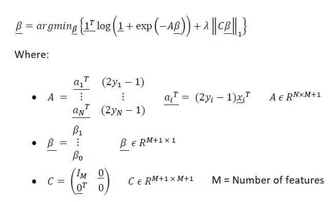
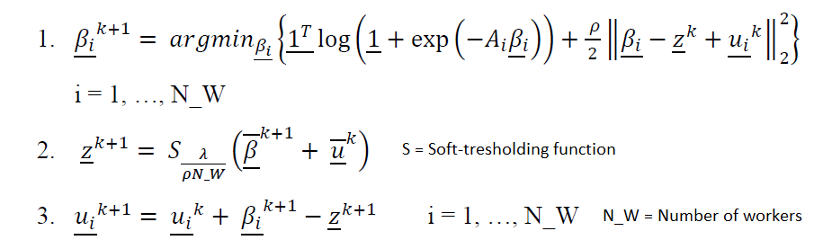
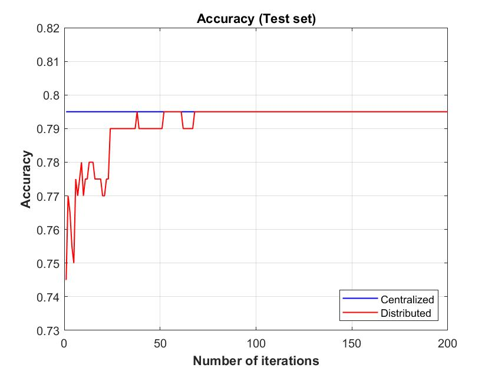
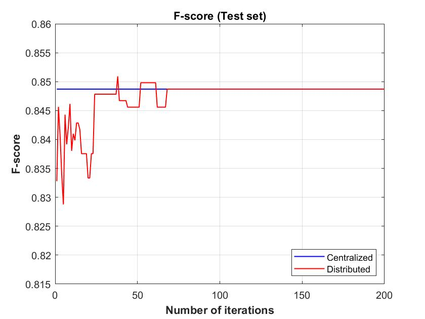

# Implementation-of-a-sparse-logistic-regression-using-ADMM

## Introduction
In this project, a supervised classification problem is addressed, the ultimate goal of which is to predict from a specific input the stability or instability of an electrical grid. Classification is done by implementing sparse logistic regression in a centralized and distributed manner. It is intended to emphasize that the focus of the project is on the algorithmic and Matlab implementation part of the predictive model in question.

You can find information about the dataset used at the following link: https://github.com/pier-l/Local-stability-analysis-of-the-4-node-star-system-using-machine-learning. Note that the same dataset can be used for regression or classification problems depending on the target column you choose.

## Centralized approach
As already said, the algorithm used in this project a binary logistic regression to which a regularization function is added, which in this case is the L1 norm. Introducing a regularization function prevents the model from being subject to overfitting. Processing is done using a centralized approach, that is, having a single worker that solves a convex optimization problem by taking all the data as input.

The following cost function has been implemented in Matlab: 

## Distributed approach
In this chapter a solution of the previous optimization problem using a distributed approach is described. The problem is divided into problems of lower dimensionality that are solved by different workers. A network consisting of 20 workers connected to a fusion center is considered.

The centralized optimization problem described above is rewritten as a consensus optimization problem, according to the algorithm formulation called ADMM (Alternating Direction Method of Multipliers). Within the Matlab script, 200 iterations of the following algorithm are performed:

## Results

The figures below show the results obtained for the two classification metrics used in this project (and for both approaches described above) as a function of the number of iterations. It can be seen that as the number of iterations increases, the values of the two metrics converge to the values obtained for the centralized solution. Equivalence between the centralized and distributed problems has been demonstrated. A distributed solution has significant advantages when, for example, the amount of data is such that it is computationally onerous for a single processor to process.

